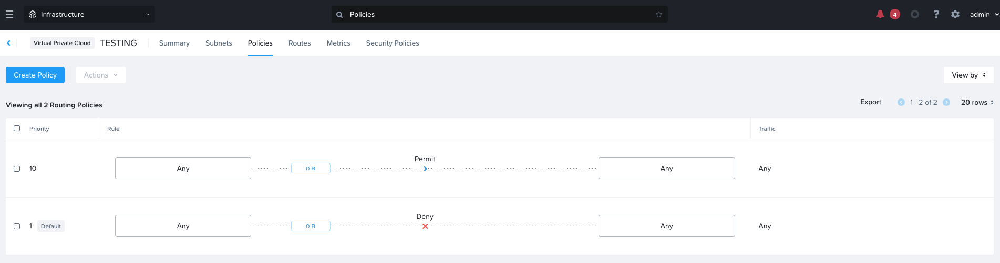

import Tabs from '@theme/TabItem';
import TabsItem from '@theme/TabItem';

      

**Create the Access control list to deny Web and DB Subnet from Communicating with each other**

1.  Launch Console into the Web and DB Virtuals to verify that they can ping each other 
2.  Click on "Network & Security", Click on "Virtual Private Clouds"
3.  Click on the VPC that you wish to apply the access control list on
4.  Click on Polices, you will see the default policies as per below

    

5.  Click on "Create Policy"
    -   Priority:   50
        **The higher priority will be inspected first**
    -   Source:                 Custom
    -   Source Subnet IP:       10.1.1.0/24
    -   Destination:            Custom
    -   Destination Subnet IP:  30.1.1.0/24
    -   Protocol:               Any
    -   Actions:                Deny
    -   Check on the box "Additional Create Policy in Reverse Direction"
6.  Click on the "Create Button"
7.  Launch Console into the Web and DB Virtuals to verify that they can't ping each other 

**Repeat the steps for the App and DB Subnets**

