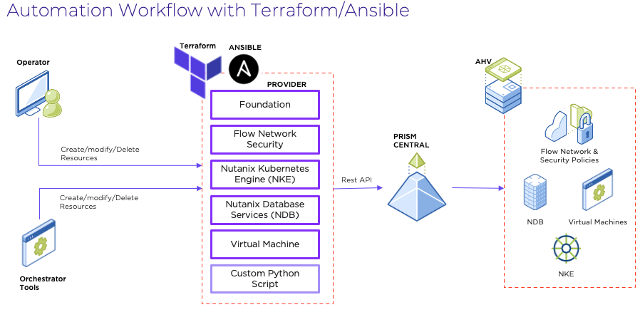

import Tabs from '@theme/TabItem';
import TabsItem from '@theme/TabItem';

# Terraform Overview

Nutanix Flow Networking have extensive integration with Nutanix Calm and Terraform, or use of Native API calls. The list of supported APIs within the Nutanix Platform can be found under the "Settings" - "Rest API Explorer". Works is currently in progress for the development for the APIv4 for Nutanix Flow Networking. 

An overview of the Terraform Integration with Nutanix is as per the diagram below:
    

For this particular lab, we will be performing automation for both the VPC backed environments and VLAN Backend MSEG Scenarios. Terraform Server VMs have been installed in both the clusters. Students will be using the terraform VMs in each cluster to execute the automation scripts that are preloaded in advance. 
