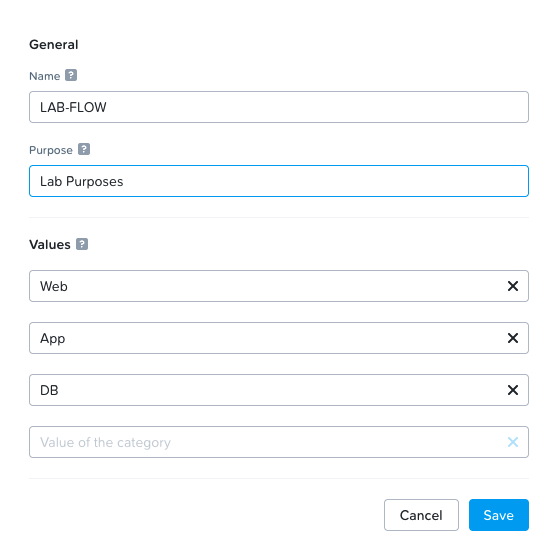

import Tabs from '@theme/TabItem';
import TabsItem from '@theme/TabItem';

**Enabling Microsegmentation**
1.  Login to the Prism Central 
2.  Click on the App Switcher 
3.  Click on Infrastructure
4.  On the right panel, scroll down to the "Prism Central Settings"
5.  Click on Microsegmentation
6.  Click on Checkbox "Enable Microsegmentation", Click on "Save"

To verify that Microsegmentation is enabled, Click on the "Network and Security" tab, Click on the "Security Policies" and verify that the MSEG policies are created for the VPC that you have created in the previous excercise. The sample screenshot is as per below:

**Create the Virtual Machines to be associated with each subnet**

1.  To create the Virtual machines, click on "Compute & Storage"
2.  Click on "VMs"
3.  Check on the check box on "CentOS VM"
4.  Click on the "Actions", click on "Clone"
    -   Click Advanced Configuration
    -   Input the following parameter
        -   Name:               Web-VM
        -   Number of Clones:   2
        -   Networks:           Select the Web Subnet that was created earlier
    -   Once done, clone the VM 
5.  Power on the VMs 
6.  Verify the VMs are able to get the IP address in that subnet 
7.  Verify login to the VMs 
    Username:   root
    Password:   nutanix/4u

For the Web Server VMs, please run the following script 

**Repeat the steps for the App and DB Subnets**

**Creating Categories**

1.  Under the Infrastructure in the App Switcher
2.  Scroll down on the side bar to go to "Administration"
3.  Click on "Categories"
4.  Click on "New Categories"
5.  Input the following parameters
    - Name : "LAB-FLOW"
    - Purpose : "Lab Purposes"
    - Values : "Web", "App", "DB"
    - Click on Save

A sample of the output is as per below

**Assigning Categories to the Virtual Machines**

Assign the VMs that were created previously into their respective categories.

1.  Scroll down on the side bar to go to "Compute and Storage", Click on "Virtual Machines"
2.  Click on the checkbox beside the Web Server VMs, Click on the Action dropdown box. Click on "Manage Categories" , under the search type in "LAB-FLOW: Web" category. Click Save.
3.  Repeat the same for the App Server VMs, and assign them to the "LAB-FLOW: App" Category, click Save.
4.  Repeat the same for the DB Server VMs, and assign them to the "LAB-FLOW: DB" Category, click Save.

To verify the VMs are assigned to the categories

1.  Under the Infrastructure in the App Switcher
2.  Scroll down on the side bar to go to "Administration"
3.  Click on "Categories"
4.  Click on the "LAB-FLOW" Category
5.  Verify that the VMs are listed and populated in the right values.
