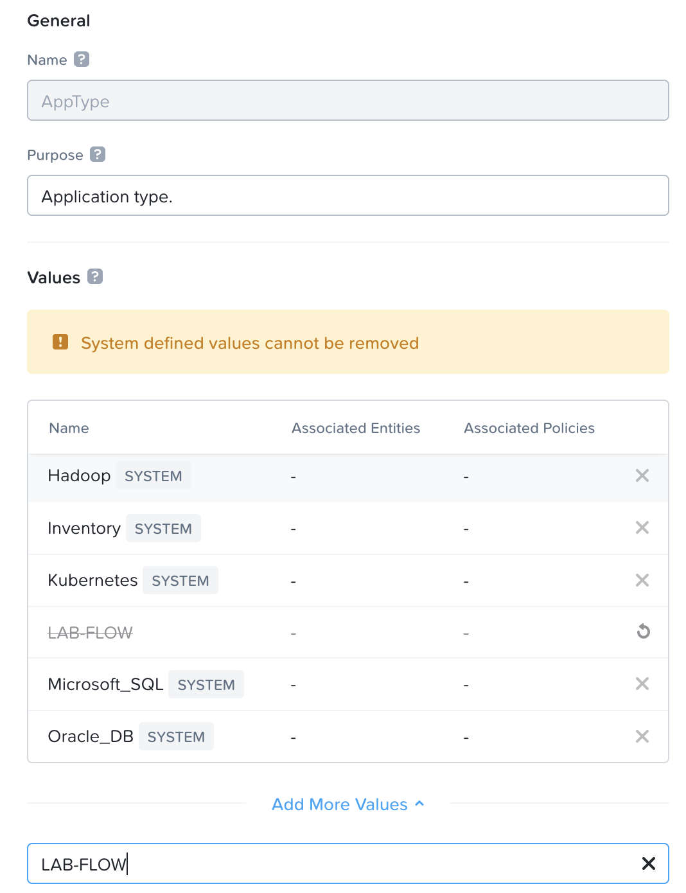
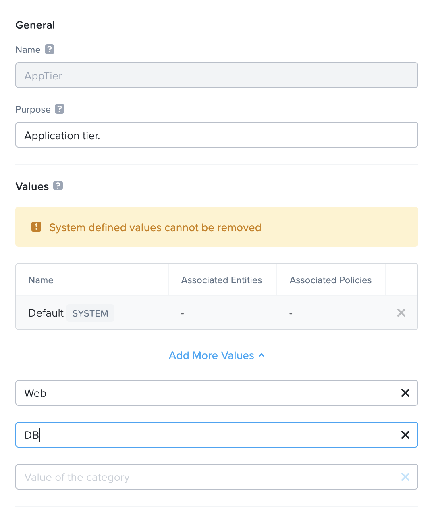
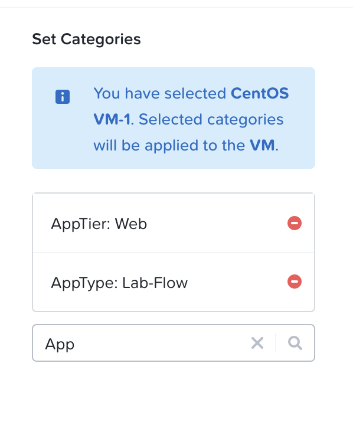

import Tabs from '@theme/TabItem';
import TabsItem from '@theme/TabItem';

**Create the Virtual Machines to be associated with each subnet**

1.  To create the Virtual machines, click on "Compute & Storage"
2.  Click on "VMs"
3.  Check on the check box on "CentOS VM"
4.  Click on the "Actions", click on "Clone"
    -   Click Advanced Configuration
    -   Input the following parameter
        -   Name:               Web-VM
        -   Number of Clones:   2
        -   Networks:           Primary

    -   Once done, clone the VM 
5.  Power on the VMs 
6.  Verify the VMs are able to get the IP address in that subnet 
7.  Verify login to the VMs 
    Username:   root
    Password:   nutanix/4u

**Repeat the steps for the  DB VMs**

**Creating Categories**

1.  Under the Infrastructure in the App Switcher
2.  Scroll down on the side bar to go to "Administration"
3.  Click on the  "App Type"
    - Add in a new App Type value - "LAB-Flow"
    - Click Save

    

4.  Click on the "App Tier"
    - Add in a new App Tier value - Web
    - Add in a new App Tier value - DB
    - Click on Save

    

**Assigning Categories to the Virtual Machines**

Assign the VMs that were created previously into their respective categories.

1.  Scroll down on the side bar to go to "Compute and Storage", Click on "Virtual Machines"
2.  Click on the checkbox beside the Web Server VMs, Click on the Action dropdown box. Click on "Manage Categories" , search for the following:
    For the Web Servers, 
    - App Tier - Web
    - App Type - LAB-Flow

    For the DB Servers, 
    - App Tier - DB
    - App Type - LAB-Flow

A sample of the output as per the screenshot below 
    

3.  Click Save.

To verify the VMs are assigned to the categories

1.  Under the Infrastructure in the App Switcher
2.  Scroll down on the side bar to go to "Administration"
3.  Click on "Categories"
4.  Click on the "App Type" Category & "App Tier" Category
5.  Verify that the VMs are listed and populated in the right values.

