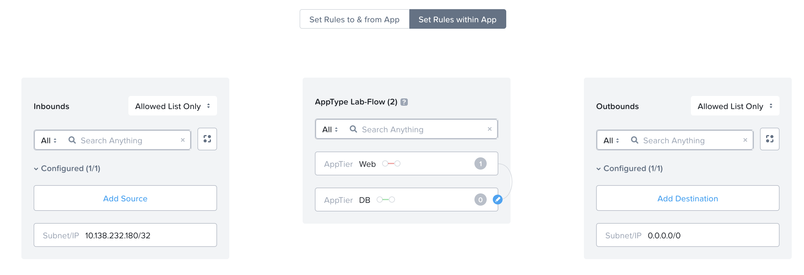

import Tabs from '@theme/TabItem';
import TabsItem from '@theme/TabItem';

**Creating Microsegmentation Policies**

1.  Under the Infrastructure in the App Switcher
2.  Scroll down on the side bar to go to "Security Policies"
3.  Click on "Create Security Policy"
4.  Click on "Secure Applications (App Policy)"
5.  Click "Create" 
6.  Input the following parameters
    - Name : "LAB-FLOW"
    - Purpose: LAB 
    - Secure this app : Lab-Flow 
    - Policy Hitlogs :  Enabled
    - TESTING123456
    Click Next 

7.  There is 3 different sections: Inbounds, App Type and Outbounds
    -   Click on "Set Rules on App Tier, Instead"
    -   Add in the "Web" and "DB" Tier 

8.  Rules to be set for in and out of the app
    1.  Allow only outbound communication from the Web Tier to any address (allow all ports)
    2.  Allow only inbound connection from your PC IP address to the Web Tier and DB Tier VMs (allow all ports)

    A sample of the output is as per below 
        

9.  Rules to be set within the App
    1.  Disallow Communciation within the same Tier for Web VMs
    2.  Allow all Communications from the Web to DB VMs

    A sample of the output is as per below
            

    Click Next

10. Click on the Radio button "Enforce". Click Save and Enforce

10. Verification that the Rules are working 
    1.  Ping from your PC to the Web and DB VM is successful
    2.  Ping from the Web to DB VMs are successful
    3.  Ping from the Web VM to the PC is successful
    4.  Ping between the Web VM  fail (because we disallowed VMs in the same tier to communicate with each other)
    5.  Ping from the DB to the Web VM should fail (because we did not allowed traffic originating from DB to the Web VM)
    6.  PIng from the DB to the PC fail (because we did not allow traffic originating forom DB to the Web VM)
    
    **The external subnet can be shared by 1 or more VPCs in a real world scenario**

