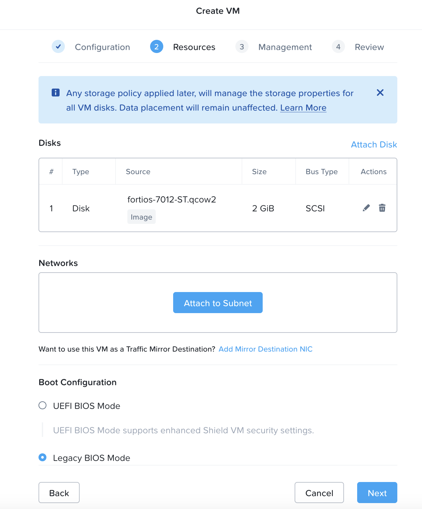

import Tabs from '@theme/TabItem';
import TabsItem from '@theme/TabItem';

**Allocate Floating IP address**

Floating IPs are routable IP address that are used to assign to the Virtual machines that have a private non-routable ip address within the VPC scope. We are going to request for the floating ip address from the external subnet

1.  Login to the Prism Central 
2.  Click on Infrastructure in the App Switcher
3.  Scroll down on the side bar to go to Network and Security 
4.  Click on "Floating IPs" 
5.  Click on "Request Floating IP" to request for the floating ip address

**Creating the Fortigate Firewall Virtual Machine**

1.  Login to the Prism Central 
2.  Click on Infrastructure in the App Switcher
3.  Scroll down on the side bar to go to Compute and Storage 
4.  Click on "VMs" 
5.  Click on "Create VMs"
6.  Create the Palo Alto VM with the following settings
    - Name: "Fortigate VM"
    - CPU: 1 
    - Cores Per CPU: 1
    - RAM : 2GB
    - Disk Settings as per below

    

    -   For the network settings, will need to create 1 NIC for the Virtual Firewall, for simplicity the Management IP of the Firewall will be used as the Production IP as well

        Management Virtual NIC Settings 
        Networks : Assign this to the NFV-Subnet that was created within the VPC 
        - DHCP Settings: Assign with DHCP 
        - Floating Address Assignment: Assign Floating IP
            - Take note of the "Floating IP address assigned"

    - Boot Configuration : Legacy Bios Mode
    - Click Next
    - Click Save to create the VM. 
    - Power on the VM, and launch console into the VM to verify the installation is complete.
    - Once the installation is completed, connect to the web console of the firewall via the assigned floating ip address. For example: https://"Firewall Virtual Machine Floating IP address"
    - Please login with the default credentials, no password required
        - username: admin
        - password: 
    - You will be prompted to change the password upon login.

