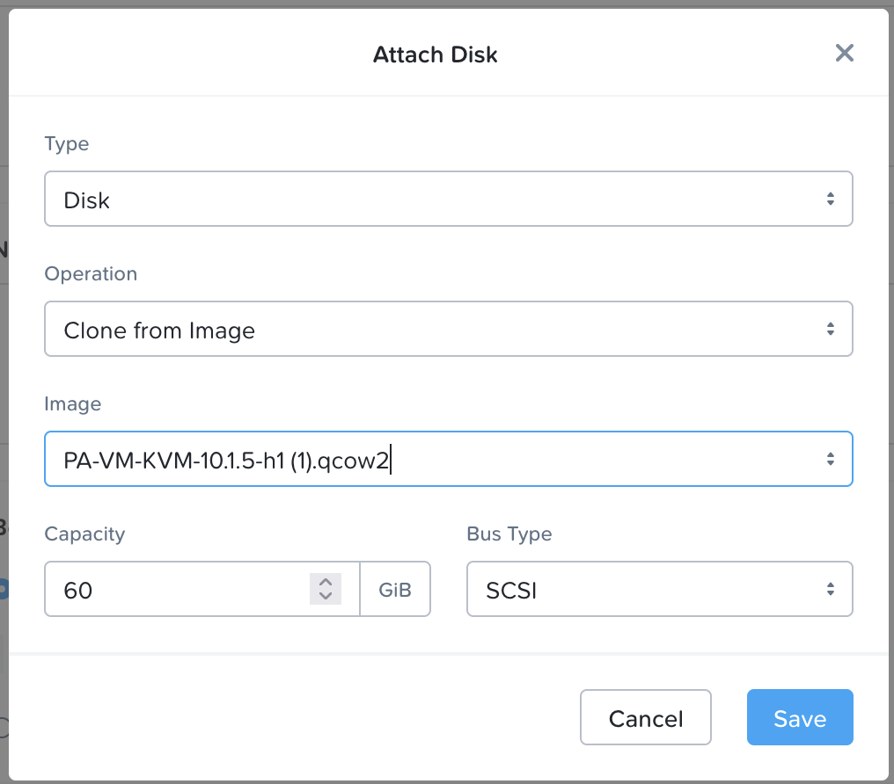

import Tabs from '@theme/TabItem';
import TabsItem from '@theme/TabItem';

**Allocate Floating IP address**

Floating IPs are routable IP address that are used to assign to the Virtual machines that have a private non-routable ip address within the VPC scope. We are going to request for the floating ip address from the external subnet

1.  Login to the Prism Central 
2.  Click on Infrastructure in the App Switcher
3.  Scroll down on the side bar to go to Network and Security 
4.  Click on "Floating IPs" 
5.  Click on "Request Floating IP" to request for the floating ip address

**Creating the Palo Alto Firewall Virtual Machine**

1.  Login to the Prism Central 
2.  Click on Infrastructure in the App Switcher
3.  Scroll down on the side bar to go to Compute and Storage 
4.  Click on "VMs" 
5.  Click on "Create VMs"
6.  Create the Palo Alto VM with the following settings
    - Name: "PALO ALTO VM"
    - CPU: 4 
    - Cores Per CPU: 1
    - RAM : 16GB
    - Disk Settings as per below

    

    -   For the network settings, will need to create 2 NIC for the Virtual Firewall, 
        -   Management IP address - Will be assigned a Floating IP address, so that web console access from the VPN will be allowed
        -   Production Interface IP - Used for the PBR next hop ip address, traffic between the different segments will be entering through this interface 

        Management Virtual NIC Settings 
        Networks : Assign this to the NFV-Subnet that was created within the VPC 
        - DHCP Settings: Assign with DHCP 
        - Floating Address Assignment: Assign Floating IP
            - Take note of the "Floating IP address assigned"

        Production Virtual NIC Settings 
        Networks : Assign this to the NFV-Subnet that was created within the VPC 
        - DHCP Settings: Assign with DHCP 
        - Floating Address Assignment: No Floating IP 

    - Boot Configuration : Legacy Bios Mode
    - Guest Customization: Select Cloud-init (Linux)
        - Save the below file as pa.yaml and upload the script

        type=dhcp‐client
        ip‐address=
        default‐gateway=
        netmask=
        ipv6‐address=
        ipv6‐default‐gateway=
        hostname=PAN
        vm‐auth‐key=297791969289142
        panorama‐server=
        panorama‐server‐2=
        tplname=
        dgname=
        dns‐primary=10.42.194.10
        dns‐secondary=10.42.194.10
        op‐command‐modes=multi‐vsys,jumbo‐frame
        dhcp‐send‐hostname=yes
        dhcp‐send‐client‐id=yes
        dhcp‐accept‐server‐hostname=yes
        dhcp‐accept‐server‐domain=yes
        op‐cmd‐dpdk‐pkt‐io=off

    - Click Next
    - Click Save to create the VM. 
    - Power on the VM, and launch console into the VM to verify the installation is complete.
    - Once the installation is completed, connect to the web console of the firewall via the assigned floating ip address. For example: https://"Firewall Virtual Machine Floating IP address"
    - Please login with the default credentials 
        - username: admin
        - password: admin

