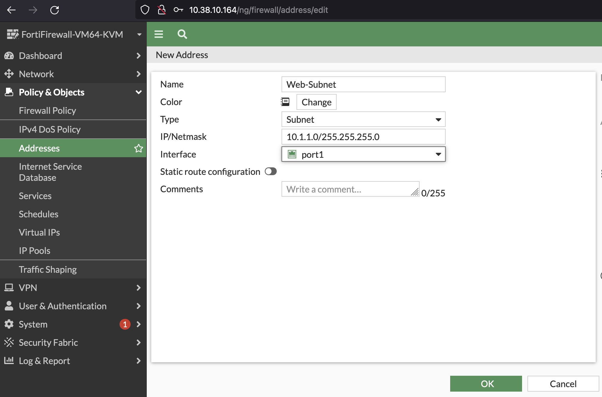
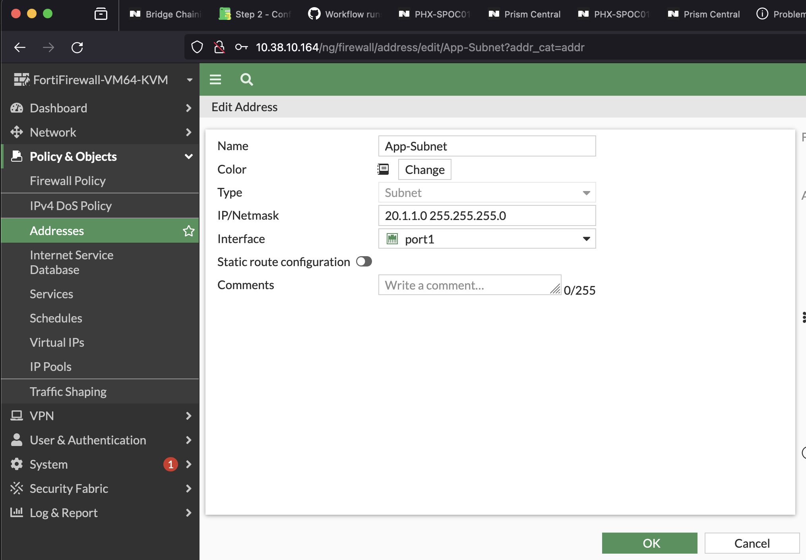
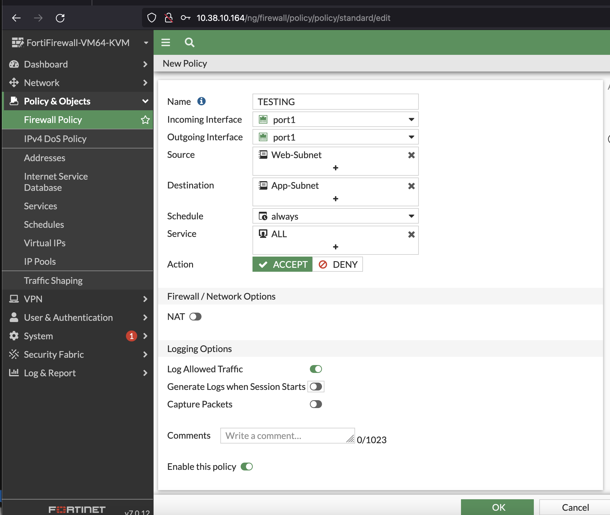

import Tabs from '@theme/TabItem';
import TabsItem from '@theme/TabItem';

**Create a Address Group**
1.  Login to the Fortigate Firewall using the web browser. (Example http://Floating IP address)
2.  Click on "Addresses" 
3.  Click on "Create New"
4.  Configure the following settings for the Web and App Address Group 
    
    

    

**Create a ANY-ANY Rule with monitoring turn on**
1.  Login to the Fortigate Firewall using the web browser. (Example http://Floating IP address)
2.  Click on "Policy" and Click on "Firewall Policies"
3.  Click on "Create New"
4.  Configure the following settings
    

    -   Click "Create" to create the firewall rule