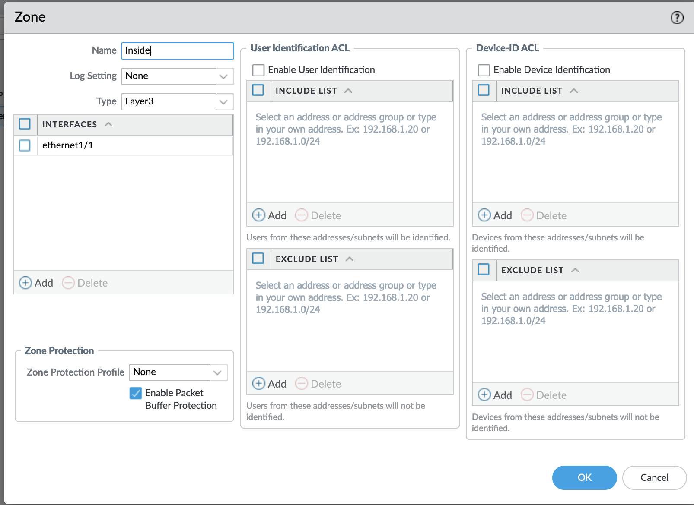
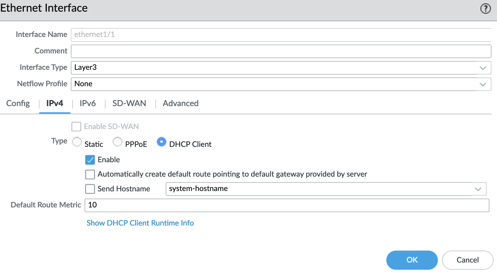

import Tabs from '@theme/TabItem';
import TabsItem from '@theme/TabItem';

**Verifying which interfaces is assigned the Production inteface**

1.  Login to the Prism Central 
2.  Click on Infrastructure in the App Switcher
3.  Scroll down on the side bar to go to Compute and Storage 
4.  Click on "VMs" 
5.  Click on the Palo Alto Virtual Machine
6.  Click on the "NIC" tab in the Palo Alto Virtual Machine 
    - There will be 2 entries for the Palo Alto VM, one for Management and the other for Production
    - Note down the Production NIC MAC address 

7.  Login to the PA Firewall using the web console
8.  Perform the following command to display the MAC address of all the interfaces on the virtual firewall
    - debug show vm-series interfaces all (https://docs.paloaltonetworks.com/content/dam/techdocs/en_US/pdf/partners/vm-series-firewall-on-nutanix-ahv.pdf)
    - Identify which interface correspond to the MAC address of the Production NIC 

**Assign DHCP Interface settings to the Production interface**
1.  Login to the Palo Alto Firewall using the web browser. (Example https://Floating IP address)
2.  Click on "Network"
3.  Click on the interface at which the Production Network is connected to , configure the following settings to the interface
    - Interface type:   layer 3
    - Security Zone:    "New Zone"
        - Follow the following settings 
            

    - Click on the "IPv4" tab
        - Select DHCP Client
        - Follow the following settings 
            

4.  Click "Ok" to save the settings
5.  Click on the "commit" button to apply the changes to the firewall 

**Create a ANY-ANY Rule with monitoring turn on**
1.  Login to the Palo Alto Firewall using the web browser. (Example https://Floating IP address)
2.  Click on "Policies"
3.  Click on "Add" at the bottom of the console panel
4.  Configure the following settings
    -   Under "General", 
        - name: Any-Any
    -   Under "Source"
        - Source Zone: any
        - Source Address: any
    -   Under "Destination"
        - Destination Zone: Any
        - Destination Address: Any
    -   Under "Application" Tab,
        - Application: Any
    -   Under "Services" Tab,
        - Any Service Service
        - Any URL 
    -   Under "Actions" Tab,
        - Action Setting:   Allow
        - Log Setting:  
            - Click on the checkbox "Log on Session Start"
            - Click on the checkbox "Log on Session End" 
    -   Click Ok

5.  Click on the "commit" button to apply the changes to the firewall 

