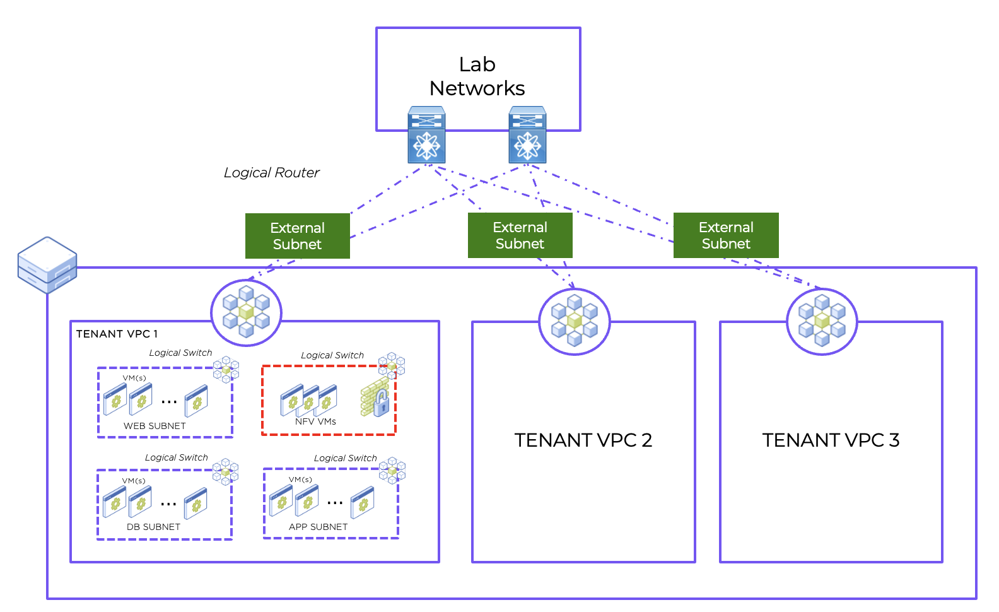

import Tabs from '@theme/TabItem';
import TabsItem from '@theme/TabItem';

# VPC Lab Overview

A VPC is a virtualized network of resources that are specifically isolated from other resource pools. VPCs allow you to manage the isolated and secured virtual network with enhanced automation and scaling. 

In order to provide connectivity to the VMs in a VPC, each VPC requires connectivity to the external environment. This connectivity can be either NAT (Network Address Translation) or No-NAT and is VLAN based. The network used for external connectivity is called an external subnet. In a NAT scenario, the IP address of the VM will be translated when it exits the logical router of the VPC, whilst in the No-NAT scenario the IP address of the VM will not be translated when it exits the logical router of the VPC. For the different use case between NAT and No NAT, please refer to the article https://www.nutanix.dev/configuring-nat-and-no-nat-vpcs-in-flow-virtual-networking/

Some of the feature around VPC are as follows
1.  Each VPC is in their own isolated routing workspace (akin to the Virtual Routing Forwarding table - VRF in networking terminology)
2.  Connectivity between VPCs will need to go through the "external" routing. Thus additional controls can be put in 
3.  Support for IP address overlapping. The subnets between the VPCs can be overlapping. For example the same subnets that existing in VPC#1 can be the same subnet in VPC#2, thus allowing fixated templates for VPC to be created more readily. 
4.  Key Security Controls are 
    -   IP access Control List (Stateless) 
    -   Microsegmentation (Stateful)
    -   Policy Based Re-route (PBR). This will allows the other features like re-routing of traffic to Virtual Load balancers and Virtual Firewalls. 

**For this particular lab, the subnet will be "NAT" enabled.**

An overview of the Network Diagram is as per below:

