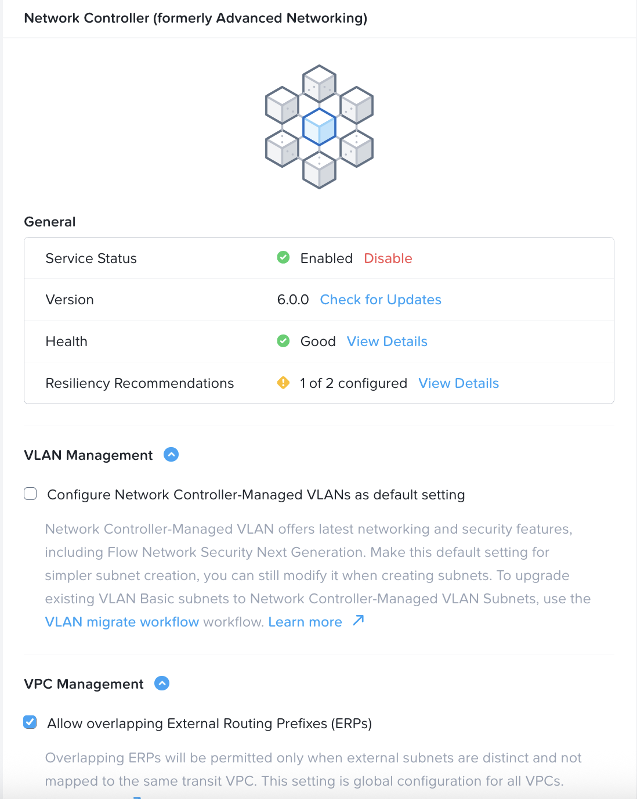

import Tabs from '@theme/TabItem';
import TabsItem from '@theme/TabItem';

**Enable the Advanced Networking Controller in the Prism Central**

1.  Login to the Prism Central 
2.  Click on Infrastructure in the App Switcher
3.  Scroll down on the side bar to go to Prism Central Settings
4.  Click on "Network Controller" 
5.  Verify that the Network Controller is already enabled. 

    
