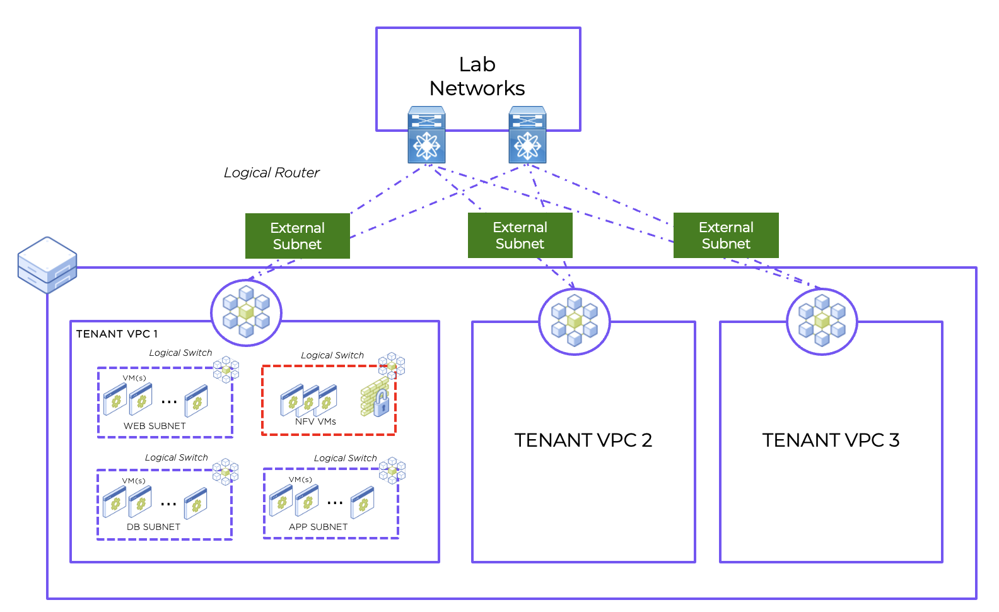

import Tabs from '@theme/TabItem';
import TabsItem from '@theme/TabItem';

# Lab 1 Creating a VPC 

A VPC is a virtualized network of resources that are specifically isolated from other resource pools. VPCs allow you to manage the isolated and secured virtual network with enhanced automation and scaling. 

In order to provide connectivity to the VMs in a VPC, each VPC requires connectivity to the external environment. This connectivity can be either NAT (Network Address Translation) or No-NAT and is VLAN based. The network used for external connectivity is called an external subnet. In a NAT scenario, the IP address of the VM will be translated when it exits the logical router of the VPC, whilst in the No-NAT scenario the IP address of the VM will not be translated when it exits the logical router of the VPC. For the different use case between NAT and No NAT, please refer to the article https://www.nutanix.dev/configuring-nat-and-no-nat-vpcs-in-flow-virtual-networking/

**For this particular lab, the subnet will be "NAT" enabled.**

An overview of the Network Diagram is as per below:

# Lab 1.1 Enable the Advanced Networking Controller in the Prism Central 

1.  Login to the Prism Central 
2.  Click on Infrastructure in the App Switcher
3.  Scroll down on the side bar to go to Prism Central Settings
4.  Click on "Advanced Networking" 
5.  Click on "Enable" to enable the Advanced Networking Controller 

# Lab 1.2 Creating the VLAN Subnet for External Connectivity (If the Prism Central is shared, only 1 person in group need to perform this)
1.  Under the Infrastructure in the App Switcher
2.  Scroll down on the side bar to go to "Network & Security"
3.  Click on "Subnets"
4.  Click on "Create Subnet" 
5.  Input the following parameters
    - Name : "Primary-External"
    - Type : "VLAN" 
    - Cluster : //Select the Cluster that you are using//
    
    - Once a cluster has been selected, options will appear for VLAN ID and Virtual Switch.  Enter the VLAN number that corresponds to the subnet.  If you want a DHCP server in the subnet, check the IP address management box and you will be prompted to enter the DHCP scope.  Finally, select the virtual switch – in most cases, there is a single virtual switch that contains subnets for the cluster, vs0.

    - Click on the “External Connectivity for VPCs” button to indicate this subnet is used for external connectivity. Once that is done, more options will be displayed as per the screenshot below.

    - Click on the "NAT" checkbox. Ensure that the Checkbox have a tick.
    - Refer to the Network IP address and the Gateway Information provided in the Spreadsheet 
    - IP address Pool: //Please assign an IP Range of 15 IPs//
    - Click on the "Create" Button to create the subnet. 
    
    **The external subnet can be shared by 1 or more VPCs in a real world scenario**
      

# Lab 1.3 Creating the VPC 
1.  Under the Infrastructure in the App Switcher
2.  Scroll down on the side bar to go to "Network & Security"
3.  Click on "Subnets"
4.  Click on "Create Subnet" 
5.  Input the following parameters

