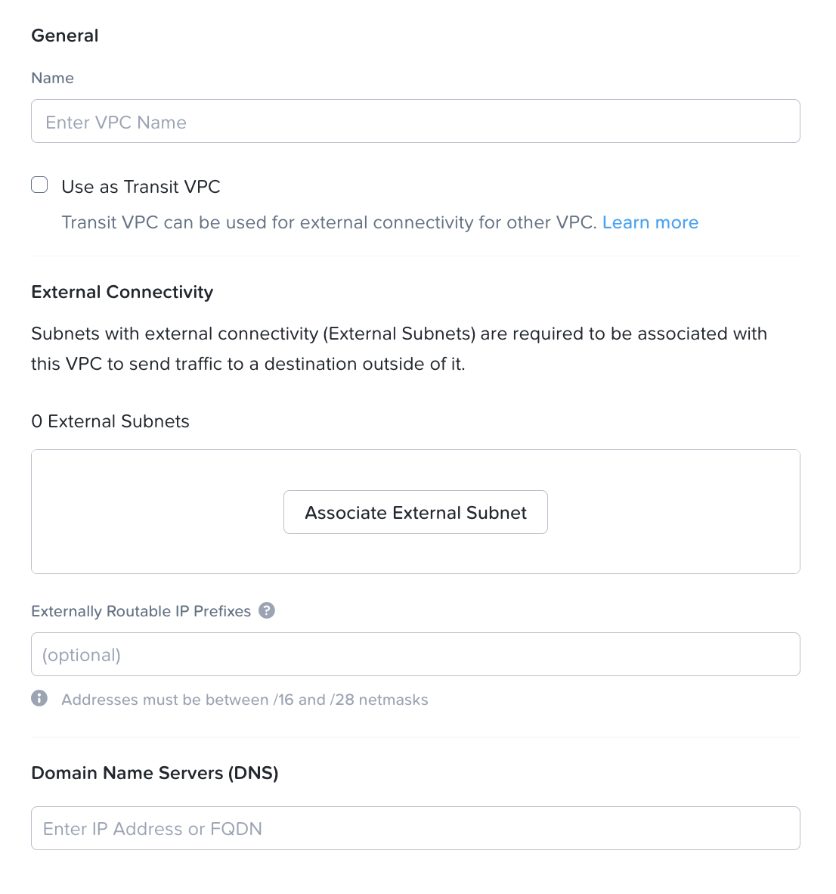
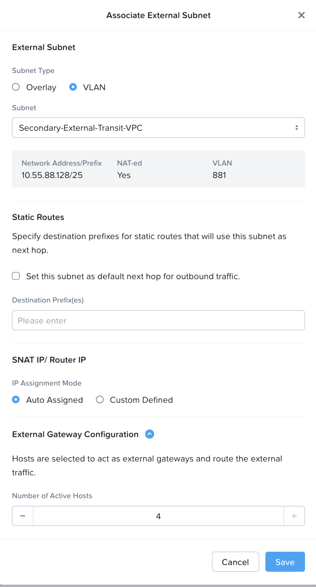

import Tabs from '@theme/TabItem';
import TabsItem from '@theme/TabItem';

      

**Creating the VPC**

1.  Navigate to “Network & Security”. Click on the Virtual Private Cloud option. Click on "Create VPC", the following screen will appear

2.  Input the following parameters 
    - Name:                 "VPC Name to be created"
    - Do not check on the box for the "Use as Transit VPC"
    - Click on the "Associate External Subnet"
            Under the external subnet, 
            Subnet Type:          VLAN
            External Subnets:     "Select the name of the External Subnet that was created in Lab 2"
            Click on the checkbox to "Set this subnet as default next hop for Outbound Traffic" 
            SNAT IP / Router IP:    Auto Assigned
            External Gateway Configuration: 4 (This will configure the Gateway Scaleout feature to allow up to 4 active gateway)
            Click "SAVE"

    - External Routable IP address: "Leave it empty"
    - Domain Name Servers:  10.42.194.10
    
3.  Click on the "Create" button to create the VPC 

