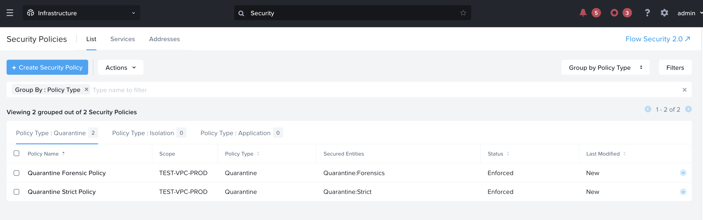

import Tabs from '@theme/TabItem';
import TabsItem from '@theme/TabItem';

# VPC Lab & MicroSegmentation Overview

In the labs so far, we have created the Virtual Private cloud which have allowed isolation between differenting traffic within the subnet itself. 

Alternatively, some companies can choose to deploy only Microsegmentation within their environment if they deem that having categories tags assigned to the Virtual machines are a more effective security policy and that adding on the Layer 3 ACL will be more cumbersome and adds on to the overall complexity when troubleshooting arises. 

Nutanix Micro-segmentation works on the basis of Categories values. The same tags can be applied to Virtual Machines of similar functionalities, thus grouping them based on their functions are a way to ensure security is applied based on the Functions instead of the IP addresses. 

Some key steps to Microsegmentation in a VPC
1.  Enabling the Advanced Networking 
2.  Create a VPC in the Virtual Private Cloud (This has been completed in the previous lab, thus will not need to create another VPC again)
3.  Upgrade the Flow Network Security in the PC and PE to 3.0 in the LCM 
4.  Enabling Microsegmentation 

An overview of the Network Diagram is as per below:

