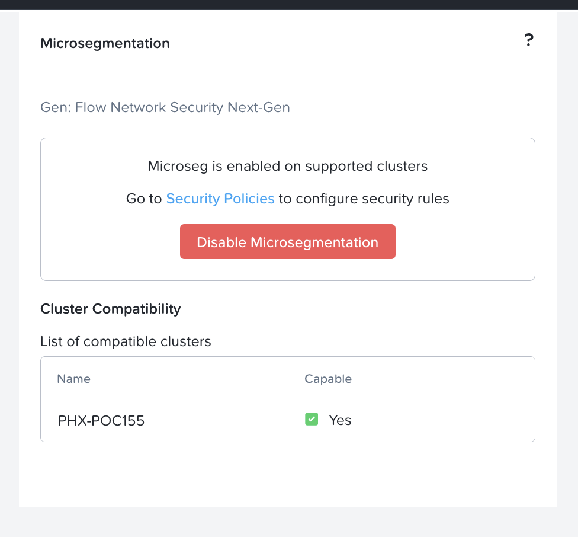

import Tabs from '@theme/TabItem';
import TabsItem from '@theme/TabItem';

**Enabling Microsegmentation**
1.  Login to the Prism Central 
2.  Click on the App Switcher 
3.  Click on Infrastructure
4.  On the right panel, scroll down to the "Prism Central Settings"
5.  Click on Microsegmentation
6.  Click on Checkbox "Enable Microsegmentation", Click on "Save"

To verify that Microsegmentation is enabled, Click on the "Network and Security" tab, Click on the "Security Policies" and verify that the MSEG policies are created for the VPC that you have created in the previous excercise. The sample screenshot is as per below:

