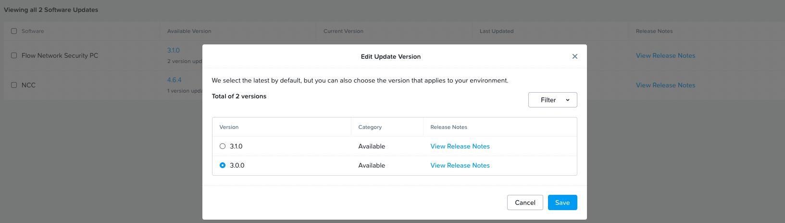

import Tabs from '@theme/TabItem';
import TabsItem from '@theme/TabItem';

**Upgrading Prism Central to Flow Network Security 3.0**
1.  Login to the Prism Central 
2.  Click on the App Switcher 
3.  Click on Admin Center
4.  Under the Admin Center, click on "LCM"
5.  Click on Inventory, click on Perform inventory and "Proceed" to perform LCM inventory update. Once the inventory is updated. Click on Updates
6.  Under the Updates, go to the entry for "Flow Network Security PC". The latest release version is 3.1.0, Click on the "3.1.0" and change it to 3.0.0. (Note the Version 3.0.0. is used for VPC + MSEG, while the Version 3.1.0 is used for performance optimization on VLAN Backed MSEG). Click "Save Screenshot as per below

7.  Select the Checkbox for "Flow Network Security PC", and click on "View Update Plan"
8.  Click on "Apply 1 Updates"

Once the installation is completed. Verify that the version is 3.0.0.
Proceed to the next step on upgrading Prism Element 

**Upgrading Prism Element to Flow Network Security 3.0**
1.  Login to the Prism Element 
2.  Click on "Home" Drop down list 
3.  Click on "LCM"
4.  Click on "Inventory", Click on "Perform Inventory", Click on "Proceed". Once the inventory is updated. Click on Updates, go to Software
5.  Under the software section, ensure that the "Flow Network Security PE" is Version "3.0.0", click on the checkbox on "Flow Network Security PE"
6.  Click "View Update Plan"
7.  Click "Proceed" 

Once the installation is completed. Verify that the version is 3.0.0.

