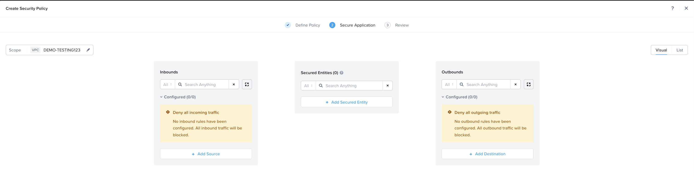
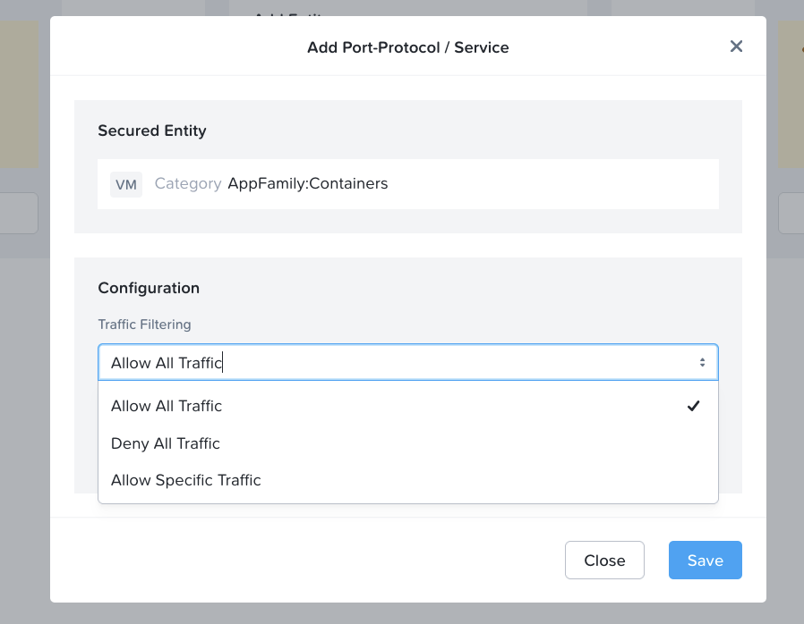
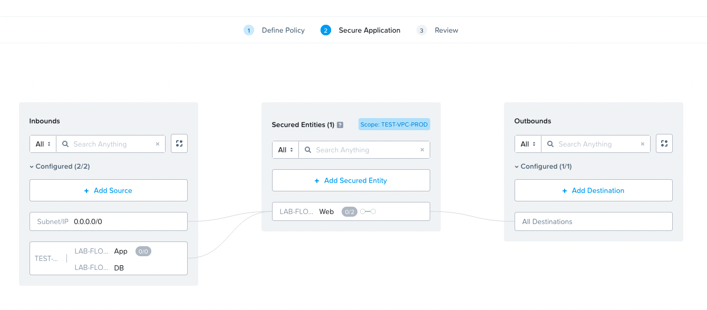
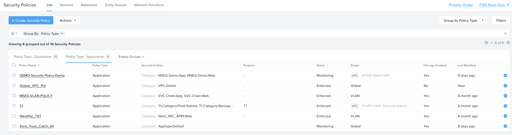

import Tabs from '@theme/TabItem';
import TabsItem from '@theme/TabItem';

**Creating Categories**

1.  Under the Infrastructure in the App Switcher
2.  Scroll down on the side bar to go to "Administration"
3.  Click on "Categories"
4.  Click on "New Categories"
5.  Input the following parameters
    - Name : "LAB-FLOW"
    - Purpose : "Lab Purposes"
    - Values : "Web", "App", "DB"
    - Click on Save

A sample of the output is as per below

**Assigning Categories to the Virtual Machines**

Assign the VMs that were created previously into their respective categories.

1.  Scroll down on the side bar to go to "Compute and Storage", Click on "Virtual Machines"
2.  Click on the checkbox beside the Web Server VMs, Click on the Action dropdown box. Click on "Manage Categories" , under the search type in "LAB-FLOW: Web" category. Click Save.
3.  Repeat the same for the App Server VMs, and assign them to the "LAB-FLOW: App" Category, click Save.
4.  Repeat the same for the DB Server VMs, and assign them to the "LAB-FLOW: DB" Category, click Save.

To verify the VMs are assigned to the categories

1.  Under the Infrastructure in the App Switcher
2.  Scroll down on the side bar to go to "Administration"
3.  Click on "Categories"
4.  Click on the "LAB-FLOW" Category
5.  Verify that the VMs are listed and populated in the right values.

**Creating Microsegmentation Policies**

1.  Scroll down on the side bar to the "Network & Security", click on "Security Policies"
2.  Click on "Create Security Policy"
3.  Input the following parameters
    - Policy Name: LAB-FLOW-Policy
    - Purpose: Lab Flow Policies
    - Click on the radio button "Security Entities (Application Policy)
    - Click Next
    - On the Top right corner, choose the scope of the Policy, this is where you can apply if the policy is a global scope, a VPC, or part of a VLAN. 

    
    

For this lab, we are securing the entities for Web Server

1.  Click on the Secured Entity, select Entity as "VM 
    - Search for Web. Select the "LAB-FLOW: Web" Category.

    - Under the options "Can VMs in this group talk to each other ", select - "Yes"
      - This will alow the VMs in the same category to communicate with each other, in the event where there is no need for the communications to happen for VMs in the same category, then select "No"

    - With the release of 7.3, Nutanix allows specific ports to be used for communications with the VMs in the same categories. For example in the event where its a set of Database server, where they need to send and receive hellos messages to verify the availabilty of the Database Servers. An overview of the screenshot is as per below 

    

2.  Click on the Add Source

    - Click on the checkbox for "Select Multiple Categories"
    - Search for App. Select the "LAB-FLOW: App" Category
    - Search for DB. Select the "LAB-FLOW: DB" Category
      Click on the Add button

3.  Click on the Source that was added, a "+", this will allow the specific set of services to be accessible from the Source Category to the Security Entity, in this case the "Web" category. Click on "Select a Service"

    - Allow only TCP/22, click "Add Row"
    - Allow ICMP.
      This will allow SSH and ICMP services from the Web Servers

    

4.  Click on the Add Source

    - Select the Add Source by "Subnet/IP"
    - Key in the values "0.0.0.0/0"
      Click on the Add button

5.  Click on the Source (0.0.0.0/0) that was added, a "+", this will allow the specific set of services to be accessible from the Source Category to the Security Entity, in this case the "Web" category. Click on "Select a Service"

    - Allow only TCP/80, add row
    - Allow only TCP/443

    This will allow HTTP and HTTPS into the Web Servers.

    

An overview of the eventual policy is as per below:
    

Click "Next", Select the radio button "Apply" to enforce the policy.
Click "Confirm", to create the policy

Verify that the policy is created under the "Policy Type: Application" as per the screenshot below
    

